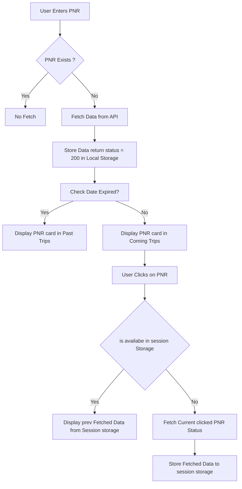
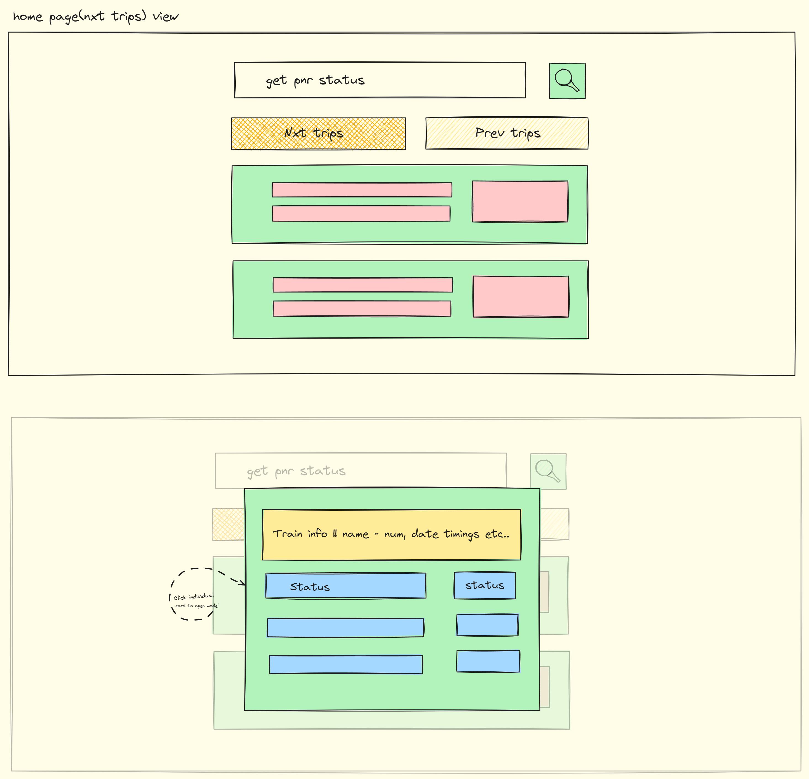

# Confirm Berth

## Checkout [Confirm Berth](https://confirm-berth.vercel.app/)

#### Work-Flow of the API Call and Functionality of the Confirm Berth

#### Wireframe of Confirm Berth

### Tech Stack and dependencies

- React.js
- TailwindCss
- react-toastify
- day.js
- react-shimmer-effects
- Workbox-Window

### Licence

[MIT](./LICENCE.md)
